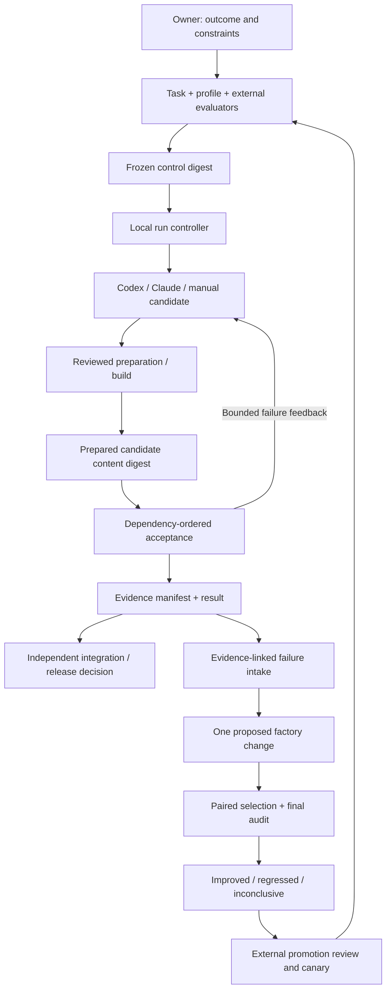
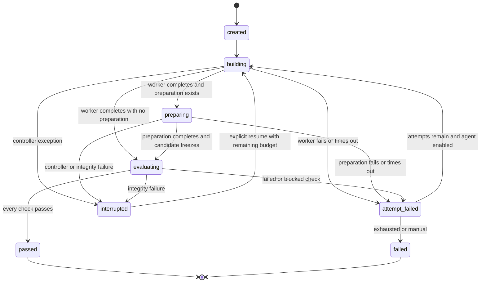

# Architecture

The controller owns workflow state and evidence collection. Task profiles describe work; they do not execute arbitrary orchestration or authorize release. Coding agents produce candidates. Evaluators establish acceptance under reviewed policy. Improvement assessment is a separate loop.

## Data boundaries

| Boundary | Contents | Writer |
|---|---|---|
| Factory runtime | CLI, schemas, controller, evaluator libraries, locked dependencies | Factory maintainers through source review |
| Control bundle | Task, profile, acceptance scripts, fixtures, reference manifest/images | Task/policy owner before sealing |
| Candidate | Product source and prepared artifacts | Coding worker |
| Run store | State transitions, subprocess output, current-run reports and artifact manifests | Controller/evaluator |
| Promotion decision | Approved version, independent audit, rollout scope and rollback target | External maintainer/release authority |

The local implementation validates disjoint paths and checks bytes before/after evaluation. It does not impose filesystem ACLs or containers. [Trust and deployment](trust-and-deployment.md) maps these logical boundaries to actual infrastructure.

## Delivery states

The stored name is `attempt-failed`. A model's final message cannot select `passed`. Check commands return structured case outcomes, and the controller verifies their exact IDs, aggregate status, exit consistency and artifact existence. A process that prints `passed` but exits unsuccessfully fails. A negative report with exit zero still fails.

## Orchestration

Optional `task.preparation` commands run sequentially after the worker and before the candidate is frozen. They may write build outputs in the candidate. A failed preparation step stops that phase and prevents acceptance, so an old static export cannot be accepted after a failed rebuild. Preparation records process outcomes and input/output digests; it does not produce a product acceptance verdict. The managed static server starts only after successful preparation. Without an explicit preparation command, the controller does not infer or run an application build.

Checks declare `dependsOn`. The controller topologically sorts them and rejects cycles or missing dependencies. Failed producers block consumers; independent checks still execute to collect useful diagnostics. No consumer requires a stale artifact from a previous run to reach its producer.

Each attempt gets its own output directory. The candidate is hashed immediately before and after evaluation. Reports include policy, candidate and runtime digests, platform, Node version, run/attempt IDs and measured check durations. Artifact bytes are hashed, not judged fresh by filesystem timestamps.

`node_modules` and `.git` are excluded from candidate hashing. Protected preparation must install locked dependencies and make them immutable; see the deployment contract. Factory runtime identity includes its CLI, source, schemas, package manifest and lockfile, but does not authenticate installed dependencies or an operating-system image.

## Why a small controller

The first release supports one local controller per run, bounded retries and recoverable file state. It does not introduce a queue/database/agent swarm without a measured need. Independent jobs can run in separate workspaces. For distributed operation, retain the contracts and replace the local store with durable job ownership, leases, idempotent effects and an authenticated evidence service.

The [decision record](decisions.md) explains why these choices fit a small initial production line and what would justify changing them.
