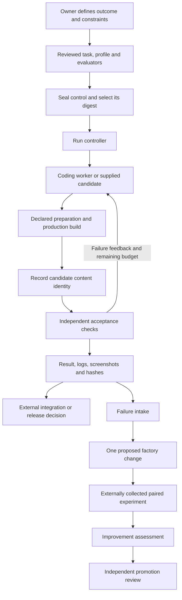

# Project Factory Next: the complete operating guide

This guide explains the factory built in this repository: what every major part does, why it exists, how to run it, how to customize it, and how to improve it without confusing a better score with better software. It describes version 0.1 at implementation revision **e0c7145**, including the image-readiness and accessibility-timing fixes merged in [PR #1](https://github.com/koldovsky/project-factory-next/pull/1).

The implementation is a local delivery and evaluation engine. It can call a coding agent, build its output, run independently specified acceptance checks, preserve evidence, and assess supplied improvement experiments. Experiment execution, authenticated approval, deployment, automatic memory and distributed scheduling remain external integrations. That boundary matters when deciding what to automate next.

## How to read the guide

| Your question | Read |
| --- | --- |
| What is a factory, and how do its parts fit together? | Sections 1–3 below |
| How do I run a complete example without a paid model? | Section 4 |
| How do I define quality and customize a task? | Sections 5–6 |
| What happens during execution, and what evidence is saved? | Sections 7–8 |
| What are every CLI command, field, limit and runtime option? | [Contract and runtime reference](handbook/reference.md) |
| How do I clone a website or implement design frames? | [Visual workflows](handbook/visual-workflows.md) |
| How does self-improvement actually work, including the mathematics? | [Measured improvement](handbook/measured-improvement.md) |
| How do I diagnose failures, control costs and operate it? | Sections 9–11 |
| What did the real Next.js cloning trial demonstrate? | Section 12 |
| How should I extend the implementation? | Section 13 and the source map |

The commands below run from the repository root. PowerShell examples use a new sibling laboratory directory, so the factory, product, policy and evidence remain separate. Example names and budgets illustrate the mechanism; they are not universal product requirements or recommended spending amounts.

## 1. What a software factory produces

A factory turns a specified outcome into a **candidate plus evidence about that candidate**. For example, “implement this landing page” becomes a versioned task, reference frames, behavior rules, a built application, test outcomes and screenshots. The final deliverable is larger than the agent's source changes: a reviewer needs to know what was required, what was tested, which bytes were tested and what remains unresolved.

There are two loops, with different owners and different questions:

| Loop | Question | Permitted changes | Decision |
| --- | --- | --- | --- |
| Product delivery | Does this candidate satisfy this task? | Product source and declared build outputs | Accepted or not accepted under a fixed contract |
| Factory improvement | Does this proposed way of working improve outcomes across tasks? | A versioned prompt, model choice, tool, profile or factory implementation | Improved, regressed or inconclusive under a registered experiment |

A delivery worker may repair the product after a failed test. It must not lower that test's standard. A factory maintainer may correct a defective evaluator, but that is a separately reviewed policy/runtime change with fresh evidence. Keeping these actions distinct prevents a system from “improving” by making its checks easier.

The term *dark factory* describes an ambition for little routine human intervention. This repository does not equate that ambition with unattended authority. Human work should progressively move toward defining outcomes, designing acceptance, resolving ambiguity and reviewing measured changes. Removing those responsibilities before the evidence is reliable creates silent failures rather than useful autonomy.

## 2. The architecture and its owners



The ordinary delivery loop uses one worker at a time. “Independent evaluator” refers to separately owned acceptance criteria; it does not mean another model necessarily performs the evaluation. Most acceptance here is deterministic code and browser measurement. An independent reviewer can investigate results without becoming their author.

Use this directory arrangement:

```text
workspace/
  project-factory-next/       controller, schemas and evaluator libraries
  product-candidate/         product source, dependencies and build output
  product-control/           task, profile, evaluator scripts and references
  product-runs/              state, logs and acceptance evidence
```

The runner rejects candidate, control and store directories that are the same or nested inside one another. It resolves real paths before comparing them. The factory runtime should also be separately protected, although that three-directory check does not itself enforce a separate runtime mount.

| Component | Its responsibility | Why this division exists |
| --- | --- | --- |
| Task owner | Define desired behavior, scope and exclusions | An implementation agent cannot reliably infer missing business decisions |
| Control owner | Author and review acceptance, references and profile | The implementation must not become its own answer key |
| Controller | Enforce ordering, budgets, process outcomes and evidence identities | Workflow correctness should not depend on an agent remembering a checklist |
| Builder | Inspect and change candidate product files | Concentrates model work on implementation and repair |
| Evaluator | Observe the candidate against the fixed contract | Produces falsifiable evidence instead of a completion claim |
| Improvement evaluator | Assess independently collected paired measurements | Separates factory hypotheses from demonstrated gains |
| Integration/release owner | Decide whether and where to merge or deploy | A local test result is narrower than production authorization |

These are logical boundaries on a laptop. They become security boundaries only when the infrastructure supplies separate identities, read-only mounts, constrained processes and authenticated evidence.

## 3. The important design decisions

The factory is intentionally small. Node ESM modules, native subprocesses, JSON contracts and files make the control path inspectable. A workflow framework, queue or swarm is useful only when it solves a demonstrated operational problem.

| Decision | Failure it prevents | Cost or limitation |
| --- | --- | --- |
| Explicit requirements and exact case IDs | Missing work hidden behind an overall green result | Acceptance authors must enumerate meaningful cases |
| Sealed external policy | A candidate rewriting its own tests or screenshots | Policy updates require new versions and review |
| Production build before evaluation | Edited source being judged through an old static export | Build time is paid on every relevant attempt |
| Native executable and argument arrays | Automatic shell interpretation of prompt or finding text | Commands must name a reviewed executable; Windows `.cmd`, `.bat` and `.ps1` entrypoints are rejected |
| Bounded retries and subprocess output | Endless repair loops and unbounded logs | A difficult task can end as an honest failure |
| Content hashes and separate attempt directories | Stale or changed evidence being reused unnoticed | Hashes do not authenticate a hostile writable store |
| Multiple visual signals | Similar pixels concealing missing links, text or responsive states | More cases and environmental control are necessary |
| Conservative paired improvement assessment | Small or biased samples being called progress | Many plausible changes remain inconclusive |

The full [decision record](decisions.md) gives the tradeoffs for all nineteen original design decisions. Profiles provide task-specific specialization; the controller should stay generic.

## 4. A complete first run, without a model account

### 4.1 Install and establish a working environment

The supported CI matrix uses Node 22 and 24; the package requires at least Node 22.17. Use the checked-in lockfile. The browser installation is explicit because dependency installation disables lifecycle scripts.

```powershell
npm ci --ignore-scripts
node node_modules/playwright/cli.js install chromium
npm run check
npm test
npm run demo
npm run demo:visual
```

On Linux use `install --with-deps chromium` to provision browser system dependencies. If PowerShell blocks `npm.ps1`, use `npm.cmd` for these interactive setup commands. This does not make `npm.cmd` a supported executable inside a sealed factory task: that subprocess interface deliberately rejects shell wrappers.

The software demo accepts correct slug normalization and rejects a behavioral regression. The visual demo accepts a matching authored page and rejects a changed layout. They exercise the real evaluator and need no paid model calls. A green demo proves the mechanism works in this environment; it does not prove your own contract is sufficient.

### 4.2 Assemble an inspectable laboratory task

Run this once from the repository root. It refuses to reuse an existing laboratory directory.

```powershell
$factoryLab = Join-Path (Split-Path (Get-Location).Path -Parent) 'factory-handbook-lab'
if (Test-Path -LiteralPath $factoryLab) { throw 'Choose a new laboratory directory.' }
New-Item -ItemType Directory -Path $factoryLab | Out-Null
$labControl = Join-Path $factoryLab 'control'
$labCandidate = Join-Path $factoryLab 'candidate'
$labRuns = Join-Path $factoryLab 'runs'
Copy-Item -LiteralPath 'examples/software/control' -Destination $labControl -Recurse
Copy-Item -LiteralPath 'profiles/software-change.json' -Destination (Join-Path $labControl 'profile.json')
New-Item -ItemType Directory -Path $labCandidate | Out-Null
Copy-Item -LiteralPath 'examples/software/good/slug.mjs' -Destination (Join-Path $labCandidate 'slug.mjs')
node bin/factory.mjs validate --control $labControl
```

Read the copied `task.json` and `evaluators/slug.mjs` before proceeding. The task requires whitespace/case normalization, punctuation removal and rejection of unsupported input. The evaluator checks four named cases. The candidate is a small existing implementation; manual mode will verify it rather than generate another one.

### 4.3 Seal and run the correct implementation

```powershell
$labSeal = node bin/factory.mjs seal --control $labControl | ConvertFrom-Json
if ($LASTEXITCODE -ne 0) { throw 'Sealing failed.' }
$labPolicyDigest = $labSeal.policyDigest
node bin/factory.mjs verify --control $labControl --policy-digest $labPolicyDigest
node bin/factory.mjs run --control $labControl --candidate $labCandidate --store $labRuns --policy-digest $labPolicyDigest --agent manual --run-id accepted-example
if ($LASTEXITCODE -ne 0) { throw 'The known-good example was not accepted.' }
node bin/factory.mjs inspect --store $labRuns --run-id accepted-example
```

For this authored demonstration, the same operator reads the fixture and selects the printed digest. For actual protected work, an independent review selects the digest and trusted configuration supplies it to execution. Reading an arbitrary candidate-writable seal and immediately trusting its digest is not independent policy selection.

Expected result: the run is `passed`, all four cases pass, and `releaseAuthorized` remains `false`. No visual server is necessary for a file-level software check.

### 4.4 Prove that the gate rejects a defect

```powershell
Copy-Item -LiteralPath 'examples/software/bad/slug.mjs' -Destination (Join-Path $labCandidate 'slug.mjs')
node bin/factory.mjs run --control $labControl --candidate $labCandidate --store $labRuns --policy-digest $labPolicyDigest --agent manual --run-id rejected-example
if ($LASTEXITCODE -ne 1) { throw 'The deliberate regression did not produce the expected failure exit.' }
node bin/factory.mjs inspect --store $labRuns --run-id rejected-example
node bin/factory.mjs reflect --store $labRuns --out (Join-Path $factoryLab 'findings-v1.json')
```

Expected result: the second run fails, and reflection points to the failed behavioral evidence. The first result is preserved under its original ID. `inspect` validates stored evidence; it does not claim that the current candidate still contains the old accepted implementation. Restore or repair the candidate, then use a new run ID to assess the new bytes.

This deliberately bad example is part of testing the factory. Do not delete its evidence to make the dashboard look healthier.

## 5. Turn a request into an executable quality contract

Start with externally observable behavior. “A high-quality website” is too ambiguous. “The approved heading, assets and subscription states appear at the specified widths; valid submissions reach the success state; invalid addresses show the approved error; links remain local” can become concrete checks.

Use four layers:

1. **Intent:** outcome, context, supported environment and explicit exclusions.
2. **Profile:** instructions and required capabilities shared by a task family.
3. **Acceptance:** independently defined checks and exact cases for the outcome.
4. **Execution:** worker/model choice, prepared dependencies and bounded resources.

For each requirement, ask what observation would prove it false. Include a normal case, a relevant edge or failure case, and a deliberate broken implementation where practical. An assertion that only checks whether a file exists rarely proves that the file behaves correctly.

Every requirement names one or more `checkIds`. Every check lists the exact `expectedCases`. The controller rejects unknown requirement references, duplicate IDs, missing dependencies and dependency cycles. It requires every declared check to pass, including checks not referenced by a requirement. It cannot determine whether the author's assertions truly cover the prose; that is a review responsibility.

For example, the software tutorial uses:

```json
{
  "id": "behavior",
  "kind": "command",
  "dependsOn": [],
  "expectedCases": ["trim-case", "spaces", "punctuation", "invalid-input"],
  "timeoutMs": 10000,
  "argv": ["node", "{control}/evaluators/slug.mjs"]
}
```

This is one check object, not a complete task. The command runs in the candidate directory, with placeholders expanded into argument strings and no shell. Its acceptance script lives in the control bundle. The script prints one JSON object to stdout and uses stderr for diagnostic logs:

```json
{
  "status": "passed",
  "cases": [
    {"id": "trim-case", "status": "passed"},
    {"id": "spaces", "status": "passed"},
    {"id": "punctuation", "status": "passed"},
    {"id": "invalid-input", "status": "passed"}
  ]
}
```

Exit zero alone is insufficient. A passing report must contain the complete expected case set, consistent aggregate and case statuses, a successful process exit, and every declared artifact. An empty report, duplicate or missing case, skipped status, malformed JSON, contradictory aggregate or missing artifact fails. A failed report remains failed even if its process exits zero.

Development tests remain useful. They give the builder fast feedback and help maintain the product. They complement external acceptance: a builder-owned test suite can be edited alongside the code and therefore cannot be the only authority for task completion.

Do not run hostile candidate code inside a trusted evaluator process in protected operation. The small slug tutorial imports a local function for simplicity. A malicious imported module has the evaluator process's capabilities. Stronger separation requires another process/container and an observed protocol rather than trust based on directory names.

## 6. Customize the factory without forking its core

Initialize a new, nonexistent control directory with `software-change`, `website-clone` or `design-implementation`. The generated acceptance script deliberately fails. Initialization creates a scaffold, not a ready-to-accept task. Replace the task content, evaluator and any visual references before a meaningful run.

Edit the explicit `profile.json` copy inside the new control bundle. Its `instructions` guide implementation; its `requiredCheckKinds` and supported visual `constraints` impose executable requirements. Text saying “always test mobile” is not enforcement unless the contract actually contains the required mobile cases. A substantive new profile gets its own ID, matching `task.profile`.

| Task family | Inputs to provide | Acceptance to author |
| --- | --- | --- |
| Website clone | Route/state inventory, source provenance, screenshots, original content, approved fonts/assets | Complete visual matrix, navigation, forms/search, content and runtime health |
| Design implementation | Versioned frames, tokens, assets, component variants, responsive and missing-state decisions | Frame fidelity, interaction states, semantics and keyboard behavior |
| API change | Request/response examples, error contract, compatibility and authorization rules | Success, invalid requests, repeat operations and access boundaries |
| Data transformation | Input/output schemas, representative and adversarial fixtures | Invariants, round trips where meaningful, invalid input and bounded resources |
| Performance work | Fixed workload, runtime environment and resource budget | Independently measured distributions under that workload |

Use a command evaluator for specialized measurement before inventing a new core check kind. A new profile cannot add arbitrary schema fields such as `performanceBudget` and expect enforcement; unknown properties are rejected. Store domain-specific inputs in control files that a reviewed evaluator actually reads.

Builder inputs need deliberate preparation. The prompt includes task text, profile instructions and a textual visual brief, not automatic image attachments or remote design access. Stage approved material where the worker can read it and name those paths in `task.context`. Preserve the evaluator's authoritative copies separately.

For compiled web apps, declare preparation before sealing:

```json
{
  "preparation": [{
    "id": "next-build",
    "argv": ["node", "{candidate}/node_modules/next/dist/bin/next", "build"],
    "timeoutMs": 180000
  }]
}
```

This is a task-property fragment. It assumes the intended Next.js version and dependencies are already installed. `--serve out` additionally requires the application to produce a static export. A dynamic application uses an externally established server/artifact binding and `--base-url`; the controller does not infer its start command or authenticate the URL's deployment.

See the [field reference](handbook/reference.md) for every supported property, and [visual workflows](handbook/visual-workflows.md) for the complete clone/design procedure.

## 7. What happens during an actual run

The source of truth is [runner.mjs](../src/runner.mjs). The following sequence explains the operational consequences of its ordering.

1. **Validate execution inputs.** Resolve the directories, check that they are separate, verify the externally selected control digest, validate the task/profile, and identify the factory runtime.
2. **Claim the run ID.** Create its exclusive local lock. Record agent, model, executable, budget option, serving choice and runtime identity. An existing run can only be reused with matching execution identity.
3. **Start an attempt.** Increment the attempt number and create a new attempt directory. For Codex/Claude, send the generated prompt through stdin and record the bounded process result. Manual mode skips the worker.
4. **Check policy/runtime integrity.** A completed worker is not accepted software. Verify that control and factory runtime bytes still match the selected identities.
5. **Prepare.** Execute declared build/preparation steps sequentially. Record each step's process outcome, duration, stdout/stderr and candidate digests before and after it. Stop at the first failure; do not serve or evaluate stale output after a failed build.
6. **Record candidate identity.** Hash the prepared candidate before acceptance. This is a logical freeze for comparison, not an OS-enforced read-only snapshot.
7. **Serve and evaluate.** Start the managed static server if requested. Run checks in dependency order. A failed dependency blocks its consumer; independent checks still run. Checks are sequential within this controller.
8. **Close and verify.** Close the managed server; verify policy/runtime again; compare candidate bytes before and after evaluation. A candidate change during evaluation creates an integrity failure.
9. **Preserve the result.** Write evidence, hash the attempt artifacts and append a state transition. Every check must pass for acceptance; `releaseAuthorized` stays false.
10. **Repair or stop.** Agent mode can make another attempt within the sealed budget, using bounded previous-failure feedback. Manual mode stops after its ordinary evaluation attempt. Exhaustion becomes failure; controller/integrity exceptions become interruption where the runner can record them.

Typical stored states are `created`, `building`, `preparing`, `evaluating`, `attempt-failed`, `passed`, `failed` and `interrupted`. The controller implements the transitions; the store verifies hash-linked event history rather than independently validating a complete state-transition grammar.

Preparation failure is different from acceptance failure: its report can have no executed checks. A builder failure may have only worker evidence. Do not interpret either absence as an empty set of successful tests.

A failed terminal run cannot be repaired by rerunning the same ID. Use a new ID for changed candidate bytes. A recovered nonterminal run consumes a new attempt if budget remains; it does not continue halfway through an old browser session. Retry feedback is currently held in controller memory and is not reconstructed after restart.

## 8. How to read and trust evidence

A representative run looks like this; exact directories depend on the task:

```text
product-runs/<run-id>/
  run.json
  lock.json                       present while the controller owns the run
  attempt-1/
    builder.json                  agent modes only
    preparation/next-build/
      process.json
      stdout.log
      stderr.log
    behavior/
      stdout.log
      stderr.log
      ...declared artifacts...
    visual/
      visual-report.json
      landing--desktop.actual.png
      landing--desktop.diff.png
      ...other successfully captured cases...
      stdout.log
      stderr.log
    evidence.json
```

`run.json` records execution identity, state, attempts, history and a reference to the current evaluated attempt's evidence. Each transition contains its previous event digest. Updates use a temporary file, file sync and rename. This reduces partial-write problems on a reliable local filesystem; it is not a distributed transaction service or a cryptographically authenticated audit log.

| Identity | What it binds | What it does not establish |
| --- | --- | --- |
| `policyDigest` | Control file paths and contents, excluding the seal itself when verified | Who approved that policy |
| `sourceInputDigest` | Candidate contents before preparation | A source-only Git revision; existing generated files can be included |
| `candidateDigest` | Candidate contents after preparation | Read-only enforcement or installed dependency integrity |
| `evaluatorDigest` | Factory `bin`, `src`, schemas, package manifest and lockfile | OS/container image, installed packages or external command closure |
| `executionDigest` | Recorded agent/model/executable/budget/serving settings and runtime digest | The true resolved model if its configured default changes |
| Evidence and artifact hashes | Stored report and attempt-file bytes | Authenticated origin when the same actor can rewrite the whole store |

Only the candidate root's `.git` and `node_modules` are excluded by the normal candidate manifest. Build outputs, caches and approved builder inputs elsewhere in the candidate are included. It is not a generic recursive ignore system. Protect installed dependencies separately and account for generated files when interpreting changing digests.

Use `inspect` rather than trusting an old terminal message. It verifies recorded history/execution consistency, the referenced evidence digest, the current attempt artifact manifest and report/run identity. It reads historical evidence; it does not fetch a deployment or compare the current working directory to that historical product. Earlier attempt files remain available, but `inspect` does not independently rehash every previous attempt's evidence.

In protected operation, an independently authenticated evaluator should sign or attest task, policy, candidate, runtime/environment and artifacts. A release service verifies the issuer and scope. Local hashes remain useful for content identity, but they are not a replacement for distinct write authority.

## 9. Diagnose the failure class before repairing

| Observation | Likely layer to investigate | Correct response |
| --- | --- | --- |
| Unknown field, missing requirement/check or cycle | Contract authoring | Correct and review a new unsealed contract version |
| Runtime unavailable, unsupported flag or sandbox helper error | Worker environment | Fix/provision the runtime; keep capability restrictions explicit |
| Build failed or timed out | Candidate/build preparation | Read preparation logs; repair source/toolchain, then use fresh evidence |
| Expected case missing or stdout is not one JSON object | Evaluator protocol | Correct the reporter; never turn missing evidence into success |
| Check is blocked | Dependency graph or failed producer | Inspect the producer; blocked is not passed |
| Browser environment/reference mismatch | Reference custody/environment | Use the approved environment or independently reviewed new references |
| Missing image, wrong font, overflow | Candidate assets/layout or inadequate setup | Inspect browser issues and compare against the original source |
| Whole-page pixel displacement | Layout, font metrics or scroll state | Compare geometry and source behavior before cosmetic tweaks |
| Contrast differences despite identical final pixels | State/animation timing | Confirm both audits observe the same settled state |
| Policy/runtime/candidate integrity failure | Concurrent writes or changed authority inputs | Stop, investigate, and rerun against explicit immutable inputs |

Always ask whether the original source passes the same preconditions. A menu might require scrolling before clicking; a design frame might intentionally omit a state; lazy content might need exposure before capture. Prove the cause before changing a contract.

For a genuine evaluator defect, preserve the failed run, reproduce the defect independently, fix the evaluator with a negative/positive regression, and review the new runtime/policy identity. For a product defect, keep policy fixed and repair the candidate. These workflows should not be blended into an automatic “update snapshots” action.

Recovery starts by stopping the worker tree or destroying its environment. `recover` removes a lock only when its controller PID is demonstrably dead; an alive, reused or uninspectable PID requires investigation. It does not itself change the run state or execute anything. Resume with the original options and remaining attempt budget. See the [command reference](handbook/reference.md) for exact commands and terminal-run behavior.

## 10. Use cheaper models without weakening quality

Choose a worker based on cost per accepted task under fixed acceptance, not price per generated token. Include failed attempts, repeated builds, review time and corrections. A cheaper worker that needs many repairs can be more expensive overall; a stronger model everywhere can also waste money on routine edits.

A practical division is an affordable implementation model for bounded changes, deterministic acceptance for every attempt, and targeted independent review for ambiguous requirements or difficult failures. The runner itself does not implement model routing, automatic escalation, a reviewer swarm or agent-to-agent handoff. Model changes are explicit execution choices; measure a proposed routing policy as a factory intervention.

Pass `--model` to select a model supported by the installed runtime/account. Omitting it preserves that runtime's default. The factory has no built-in model catalog or pricing service. It does not translate a model name into verified capabilities or price. Inspect the generated prompt and run an authenticated smoke task before committing a large batch.

Budgets are layered: maximum attempts, worker timeout, each preparation deadline, each check deadline, and bounded subprocess output. There is no single CLI-enforced whole-run token or dollar budget. Claude's supported optional dollar cap applies to each worker invocation; the Codex adapter rejects that unsupported option. Use an external spending controller for account-wide or run-wide monetary limits.

The Programming Mentor implementation used GPT-5.6 Luna through a supervised Codex desktop sub-agent after a standalone worker helper failed. Verification used manual mode. That demonstrates a useful supervised workflow, not successful unattended dispatch through the standalone adapter and not a measured claim about dollar savings.

### Dispatch a real implementation task

First prepare the candidate checkout, install the approved application dependencies and stage builder-visible inputs. For Codex, create a normal Git checkout/worktree before dispatch. Write and independently review the task and evaluators, capture references where needed, and select the sealed policy digest. Confirm the installed native CLI is authenticated and that the requested model is available in its account. These provisioning steps are external to the factory.

Inspect the exact worker brief before dispatch:

```powershell
node bin/factory.mjs prompt --control ../product-control --out ../product-prompt-v1.md
```

Then adapt this command to the reviewed application and installed runtime. Uppercase values and the executable path are placeholders; running it can consume model usage:

```powershell
node bin/factory.mjs run --control ../product-control --candidate ../product-candidate --store ../product-runs --policy-digest REVIEWED_SHA256 --agent codex --model ACCOUNT_MODEL_ID --executable C:/path/to/codex.exe --serve out --run-id implementation-001
```

This assumes a declared static-export build. For direct software checks omit `--serve`; for a separately bound dynamic target use `--base-url` instead. A Claude invocation selects `--agent claude`, the compatible native executable/model, and optionally a preplanned positive `--max-budget-usd` per invocation. Do not add that budget flag to the Codex command. Inspect the saved evidence after completion, including failed attempts, rather than treating the worker's final prose as the result.

## 11. Move from local use to unattended operation

Start locally with small, observable tasks. Once contracts and evidence are dependable, add the infrastructure needed for the intended autonomy. The local controller does not provision it for you.

| Stage | Add | Evidence that the stage is ready |
| --- | --- | --- |
| Local laboratory | Author contracts and exercise good/bad fixtures | Correct candidates pass; meaningful regressions fail |
| Supervised delivery | Prepared workers, separate controls, measured cost and review | Repeated representative tasks with explained failures |
| Protected evaluation | Separate worker/application/evaluator identities; immutable toolchain; constrained network/resources | Candidate cannot modify policy/evidence or access release credentials |
| Controlled integration | Protected policy selection, authenticated evidence and product-to-deployment binding | Release decisions verify the exact accepted artifact |
| Limited unattended work | External queue, durable ownership, idempotent effects, telemetry and rollback | Bounded live cohorts satisfy quality/operational objectives |
| Measured factory improvement | Authenticated experiments, held-out task custody and independent promotion | Benefits survive a preregistered final audit and limited live use |

Do not place production payments, notifications or deployments in acceptance checks. Recovery is at-least-once execution: a command can execute again after interruption. Use disposable fixtures or read-only observations; external side effects need their own durable, idempotent controller.

One local lock protects a run ID, not an entire candidate directory or all runs. Do not run two controllers against the same mutable candidate. Parallel jobs need separate workspaces and an external concurrency/resource budget. For multiple hosts, use a real lease/queue system; local PID locks on network storage are not a distributed scheduler.

The repository's source CI runs checks, tests and both demos on Windows/Linux with Node 22/24. It protects changes to the factory. It does not automatically become a trusted evaluator for every product PR. Pin the factory revision and policy outside the product's control and establish the application/artifact binding separately.

Full deployment responsibilities are in [trust and deployment](trust-and-deployment.md). Retention and downstream defect telemetry are also operator integrations: the local store does not schedule cleanup, monitor production or notify people by itself.

## 12. What the Programming Mentor trial teaches

The trial rebuilt an owned website in Next.js with fourteen built routes, thirteen visually assessed pages, desktop/mobile cases and local source assets. The acceptance policy required zero pixel and landmark drift. The latest integrity-verified run is **failed**: all five behavioral groups pass, 25/26 screenshots are exact, and eight desktop contact-input pixels differ by one RGB level. It has not been accepted for release.

The useful learning came from classifying different kinds of failure:

| Finding | Layer | Resulting action |
| --- | --- | --- |
| The initial export omitted required routes | Build/candidate | Restore static export and prepare before evaluation |
| Style-element text missed dynamically inserted rules | Source acquisition | Capture the complete ordered CSSOM as approved builder input |
| Lazy image request started after page load | Evaluator timing | Await image readiness and retain broken-image rejection |
| Original mobile menu was outside the initial viewport | Test precondition | Review a new control version with source-verified gestures |
| Axe ran during different phases of a text fade | Evaluator timing | Stabilize screenshots before auditing; rebuild the source-only accessibility baseline after independent repetitions |
| Eight rounded-border pixels still differ | Remaining visual residual | Preserve the strict failure and detailed investigation |

All 26 source PNGs remained unchanged through the reviewed policy corrections. Two source-only repetitions after the timing correction produced 52 zero-difference comparisons against those same 26 references and identical accessibility counts. A supplemental comparison found no increase in settled automated violation counts, but the configured accessibility check remained blocked by the failed visual dependency. Reporting that distinction prevented a false overall pass.

The trial intentionally used fixed video-frame contents for screenshot tests, local captured search data and a contact form that does not send messages. Inherited source accessibility defects and an article's mobile overflow were disclosed. Exactness therefore applies to a specific captured route/state/environment contract, not every future browser state or external service.

The two general evaluator fixes were regression-tested and merged as `e0c7145`; 104 tests and all four OS/Node CI combinations passed for the reviewed implementation. The detailed trial artifacts live in the sibling workspace directory `factory-tests/programmingmentor`, rather than this repository, because they include the owner's website content. They are not required to execute the repository's authored demos.

This is evidence of concrete engineering corrections on a real task. It is not a paired experiment proving a general acceptance-rate increase, autonomous learning, API cost savings or state-of-the-art performance. The [improvement chapter](handbook/measured-improvement.md) explains what would be needed to make those claims.

## 13. Extend the factory deliberately

Add task-specific evaluators and fixtures first. Change the generic controller only when a new lifecycle or authority requirement cannot be expressed safely through existing contracts. Keep a known-good version, demonstrate the defect with a useful regression, and test the changed mechanism on representative tasks.

Useful next extensions include a separate experiment runner, authenticated evidence collection, model-routing experiments, explicit task-family lesson selection, production telemetry and a scheduler that can distinguish “dependency completed” from “dependency passed.” These are proposals, not hidden existing features. The latter would let a diagnostic accessibility comparison run even when its screenshot producer completed with a pixel failure.

For any extension, answer: who can configure it, which bytes identify it, what happens on timeout or restart, what evidence proves it worked, and which negative case proves it fails safely? A new prompt paragraph is not an executable guardrail.

### Source map

| File | What to inspect there |
| --- | --- |
| [bin/factory.mjs](../bin/factory.mjs) | Exact CLI options, output behavior and exit codes |
| [src/control.mjs](../src/control.mjs) | Initialization, profile requirements, visual brief, sealing and verification |
| [src/contracts.mjs](../src/contracts.mjs) | Requirement/check relationships, dependency ordering and result validation |
| [src/runner.mjs](../src/runner.mjs) | Worker/preparation/check loop, retry feedback and evidence binding |
| [src/adapters.mjs](../src/adapters.mjs) | Runtime argv, environment filtering, deadlines and output limits |
| [src/store.mjs](../src/store.mjs) | Run locks, history, atomic state and recovery |
| [src/files.mjs](../src/files.mjs) | Safe paths, symlink rejection, manifests and runtime identity |
| [src/server.mjs](../src/server.mjs) | Managed local static serving and path handling |
| [src/visual.mjs](../src/visual.mjs) | Capture/import, deterministic cases, pixels, geometry and Axe |
| [src/visual-worker.mjs](../src/visual-worker.mjs) | Visual evaluation subprocess and command-result adaptation |
| [src/reflection.mjs](../src/reflection.mjs) | Evidence-linked failure grouping and its current-report scope |
| [src/learning.mjs](../src/learning.mjs) | Experiment validation, uncertainty and promotion-review proposal |
| [schemas](../schemas) and [profiles](../profiles) | Supported data formats and shipped task-family policy |
| [tests](../tests) | Positive, negative, integrity, browser and learning regressions |
| [.github/workflows/ci.yml](../.github/workflows/ci.yml) | Source validation matrix and aggregate required check |

### Vocabulary

| Term | Meaning in this factory |
| --- | --- |
| Candidate | Product files being implemented and assessed |
| Control bundle | Task policy, profile, evaluators and authoritative references |
| Seal | A manifest of control bytes; approval is a separate decision |
| Check | A command or visual evaluator with a declared expected case set |
| Case | One named observable obligation within a check |
| Preparation | A bounded step that can build/change the candidate before assessment |
| Attempt | One worker/preparation/evaluation cycle within a run |
| Run | A bounded execution with one identity and preserved history |
| Reflection | Grouping verified failures into investigation inputs |
| Experiment | Supplied paired measurements for one proposed factory intervention |
| Promotion | External adoption of an assessed factory version |
| Release | External integration or deployment of an accepted product artifact |

For the evidence behind the original design choices, see [the research notes](research.md). Read those as motivation and primary-source context; the code, tests and task-specific measurements determine what this implementation actually demonstrates.
