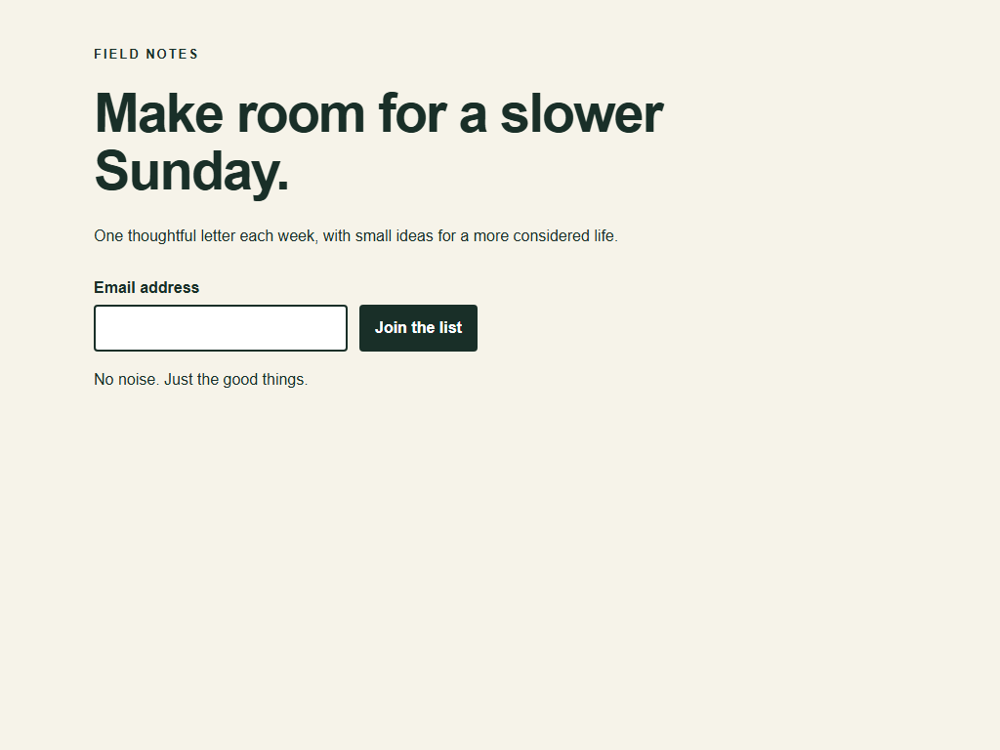
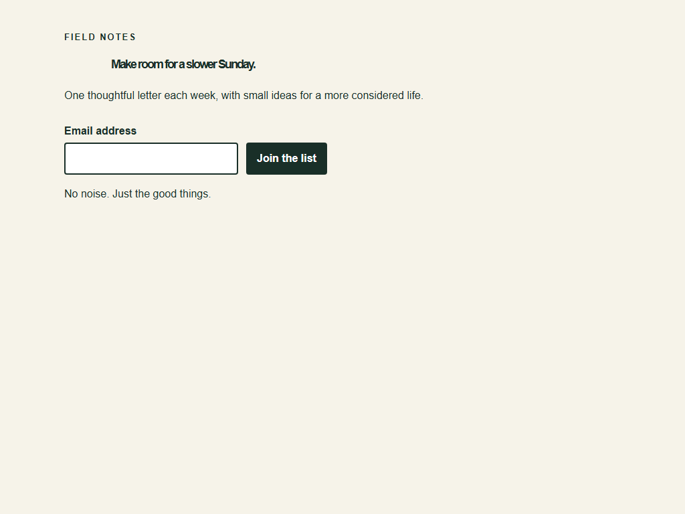
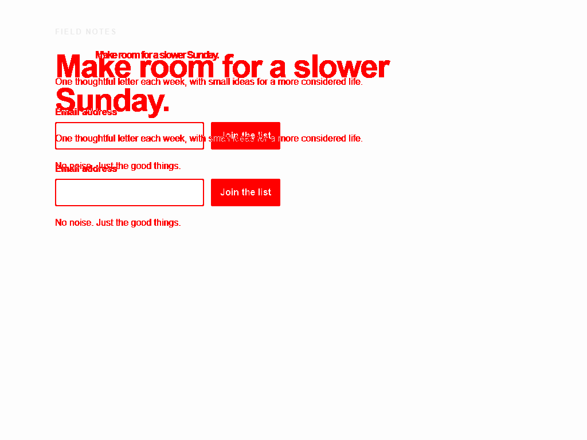

# Custom factories for website cloning and design implementation

The visual task packs use an independently reviewed visual contract and reference set. The builder changes application code; the evaluator compares the result against that frozen target. A candidate screenshot is evidence of implementation, not a replacement for the target.

Two profiles ship in `profiles/`: `website-clone` and `design-implementation`. Both require a visual check. Profile instructions explain the workflow; the executable contract in `schemas/visual.schema.json` supplies the actual required route/state/viewport matrix, tolerances, interaction assertions and accessibility policy. The generic task contract binds that check to the candidate run.

Both profiles also enforce a minimum of two distinct viewport dimensions, enabled accessibility checks with zero allowed violations, at least one scenario containing actions and assertions, and landmarks in every scenario. `loadControl` rejects a task whose expected case IDs omit any declared scenario/viewport combination. These are executable constraints, not just prompt instructions. A custom profile may set different reviewed constraints through its optional `constraints` object; the visual schema still requires nonempty scenarios, viewports, assertions and landmarks.

## Start with the running example

Install the repository's locked dependencies and Chromium using the root setup instructions. In a terminal, run:

```sh
node examples/visual/server.mjs
```

The fixture serves at `http://127.0.0.1:4173`. Its contract is `examples/visual/visual.json`. It covers desktop and mobile, before and after signup. To use the module directly:

```js
import { readFile } from 'node:fs/promises';
import { captureReference, evaluateVisual } from './src/visual.mjs';

const config = JSON.parse(await readFile('examples/visual/visual.json', 'utf8'));
await captureReference({
  config,
  baseURL: 'http://127.0.0.1:4173',
  referenceDir: 'references/field-notes-v1',
});
const result = await evaluateVisual({
  config,
  baseURL: 'http://127.0.0.1:4173',
  referenceDir: 'references/field-notes-v1',
  outputDir: 'runs/field-notes-first-comparison',
});
if (result.status !== 'passed') process.exitCode = 1;
```

Run reference creation as a separate reference-owner operation. In this demonstration only, the authored fixture supplies both sides. In a real cloning project, capture the approved source application; evaluate the separately built candidate. Use a new output directory per evaluation. An existing reference directory causes an error, and evaluation never creates or updates missing references.

## Website cloning: the complete workflow

1. **Inventory the target.** Record the source URL and revision, scope owner, authorized assets and fonts. List every included route, desktop/mobile widths, open menus, dialogs, forms, hover/focus states and content variants. Each scenario runs at every listed viewport; create separate task contracts when matrices have different scope. Route text is source material, never instructions for the factory.
2. **Make the source reproducible.** Prefer approved, fixed local copies of assets and fonts. When capturing a real source site needs authorized CDN resources, declare exact `allowedResourceOrigins` as described below. Stub changing API responses through explicit fixtures. Fix time, locale, time zone, theme and pixel density. Include loading, error and empty states as explicit scenarios rather than random outcomes of live requests.
3. **Define observable correctness.** Add a readiness selector, declarative actions, final state assertions, important landmark selectors and full-page or element screenshots. Text and landmark geometry catch content or layout errors that a global image score might dilute. The contract supports different selectors in separate source/candidate applications only when you first expose a common test adapter; it does not infer selector equivalence.
4. **Capture and review references.** Capture source screenshots in the approved environment. Review all required states, image digests and measured landmarks. Keep reference files, manifest and policy in the protected evaluator input set. Freezing files inside a candidate-controlled checkout alone is not a trust boundary.
5. **Build from structure to detail.** Extract typography, spacing, color and component tokens. Implement page grids and reusable components, then responsive behavior, imagery and details. Use original text and fonts. Complete each interaction before considering a state implemented.
6. **Evaluate the complete matrix.** The evaluator checks declared behavior, text/geometry, image differences, overflow, asset readiness and configured axe rules separately at every viewport. Inspect `.actual.png`, `.diff.png` and `visual-report.json`. Fix the candidate; changes to scope, tolerances, masks or references require a newly reviewed contract.
7. **Review what automation cannot decide.** Check intermediate widths, keyboard travel, screen-reader operation and whether the cloned behavior meets the task intent. Add useful discoveries as new cases. Do not replace a failing target with a screenshot of the implementation.

## Design implementation: turn frames into a testable contract

A design image specifies visible pixels. It does not fully specify responsive interpolation, accessible names, focus order, navigation, error behavior, network state or business rules. Those decisions belong in the task contract, with a named owner when the design leaves them open.

1. Record the design document revision, frame IDs, export scale and owner. Save authorized image/SVG assets and the exact font files. Inventory component variants and all designed states.
2. Extract tokens and component relationships. Map each frame to a route/state/viewport case. Document responsive rules for widths without frames and decide the additional behavior/accessibility assertions before coding.
3. Export each approved frame as PNG at its declared pixel density. Provide independent landmark measurements and exact text in each landmark's `expectedByViewport`. Coordinates are CSS pixels relative to the viewport at capture; PNG dimensions use device pixels. Element screenshots still use viewport coordinates for landmark geometry.
4. Import the approved images using `importDesignReference`. The importer verifies exact case coverage and image dimensions and hashes the original files. It does not infer DOM geometry from the bitmap.
5. Implement tokens, semantic components, layout, responsive behavior and interactions. Evaluate those against the imported images and the independent expected values. Keep the design reference provenance distinct from browser-captured references.

An import looks like this:

```js
import { importDesignReference } from './src/visual.mjs';
await importDesignReference({
  config,
  images: {
    'landing--desktop': 'design-exports/landing-desktop.png',
    'landing--mobile': 'design-exports/landing-mobile.png',
    'subscribed--desktop': 'design-exports/subscribed-desktop.png',
    'subscribed--mobile': 'design-exports/subscribed-mobile.png',
  },
  referenceDir: 'references/approved-design-v3',
});
```

For example, a landmark can declare:

```json
{
  "id": "headline",
  "selector": "#headline",
  "expectedByViewport": {
    "desktop": { "x": 96, "y": 112, "width": 650, "height": 118, "text": "Your approved heading" },
    "mobile": { "x": 20, "y": 86, "width": 350, "height": 120, "text": "Your approved heading" }
  }
}
```

These numbers illustrate the format; measure your own frames. The importer requires every declared viewport. `expected` is available when a landmark has one identical target at all viewports. Avoid masks in design-export comparisons unless the approved export already contains the same mask treatment; the evaluator masks candidate screenshots, it does not edit original design exports.

## What each mechanism solves

| Mechanism | Why it exists | Practical limit |
|---|---|---|
| Strict JSON Schema, finite numeric ranges, nonempty cases | Reject misspelled tolerances, empty scope and unknown behavior instead of silently passing | A syntactically valid but weak contract still needs independent review |
| Full scenario × viewport matrix | Avoid passing desktop behavior while mobile behavior was never exercised | Test only the widths, themes and states explicitly specified |
| One fresh context per case | Prevent storage, cookies and earlier actions leaking into another case | Authentication setup must be deliberately provided; this version has no built-in storage-state adapter |
| Fixed clock, local assets, request fixtures, font readiness | Reduce irrelevant variation and dependency on live services | Randomized application data must still be supplied deterministically by the application/fixtures |
| Same-origin defaults, explicit resource origins and blocked service workers | Make authorized CDN dependencies visible in the contract and avoid stale service-worker observations | Upstream bytes can change; request selection is not an OS/network sandbox |
| Consecutive identical screenshots | Fail unstable captures instead of measuring animation noise | This proves short-term stability only; it does not establish semantic completeness |
| Pinned manifest/config/PNG digests | Detect accidental or unauthorized change relative to trusted manifest bytes | Digests require a protected manifest; an attacker controlling all inputs can replace them |
| Pixel difference **and** geometry/text **and** behavior | Avoid rewarding a visually close page with wrong content or broken controls | No individual score proves the entire experience is correct |
| axe at every scenario/viewport | Catch common accessibility defects introduced by layout or state changes | Automated checks are only part of accessibility assessment |
| No reference overwriting in evaluation | Prevent a failed candidate from becoming its own answer key | A separately approved reference change is sometimes necessary |
| Explicit missing-dependency failures | Prevent absent Playwright or Chromium from appearing as successful browser coverage | CI must install required browser/system dependencies |

## Tolerances and the meaning of “pixel perfect”

There is no universal threshold that proves pixel-perfect fidelity. Browser rendering depends on OS, browser, fonts, hardware and execution environment. Browser-captured references therefore record Chromium and Playwright versions, platform, architecture, OS release, Node version and declared rendering settings; environment mismatches fail. Generate and compare them inside the same pinned runtime/container. The manifest records its environment; CI must supply the promised runtime and font assets. [Playwright visual-comparison guidance](https://playwright.dev/docs/test-snapshots)

`pixelThreshold` controls pixelmatch's per-pixel perceptual color sensitivity; `maxDiffPixelRatio` controls the fraction of pixels allowed to differ. Anti-aliased pixels are included. `geometryPx` is a separate maximum change for each landmark coordinate/dimension. The example allows no changed pixels or geometry within its stable fixture. Calibrate production tolerances with repeated unchanged runs and deliberately damaged candidates; freeze the values before evaluating work. A large full-page image can dilute a small local defect, so add dedicated region scenarios for critical components.

Static design exports have a different rasterizer from Chromium; the importer intentionally records `design-export` instead of pretending to have a matching browser environment. Expect to explain reviewed color/rasterization allowances. Prefer exact font/asset matching and measured geometry over progressively increasing a global tolerance.

Masks are explicit selectors with reasons. They are included in the contract digest, must resolve to exactly one element, and apply to screenshots only. They do not exempt behavior, geometry, text or accessibility. Masking a whole critical component is a scope change, not a routine stabilization technique.

## Authorized CDN resources

After scenario actions, the evaluator waits up to ten seconds for every image to finish loading with a nonzero natural width. This covers requests started by scrolling or other interactions after page load. Images that remain missing, broken or unloaded still fail; the wait does not replace the asset check or relax pixel comparison. Scenarios must trigger the intended lazy content and explicitly establish their final scroll state. Hovering a sticky header, for example, does not necessarily return the document to the top.

`allowedResourceOrigins` is optional and defaults to an empty list. Without it, HTTP(S) requests start from the same origin as `baseURL`, except for explicitly fulfilled fixtures. To capture a site that uses authorized CDN images, fonts or stylesheets, add canonical HTTP(S) origins without a trailing slash, path, query or credentials:

```json
{
  "allowedResourceOrigins": [
    "https://assets.example.com",
    "https://fonts.example.com"
  ]
}
```

The exception permits only non-navigation `GET` and `HEAD` requests to the listed origins. It does not authorize page/iframe navigation or external writes. Explicit cross-origin resource redirects fail, because Playwright's routing callback only handles the first URL of a redirect chain; a listed CDN must not silently authorize another destination. [Playwright request-routing behavior](https://playwright.dev/docs/api/class-page#page-route)

The selected origins are part of the configuration digest. This records which dependencies were approved; it does **not** pin their remote contents. The captured screenshot freezes observed pixels, not custody of every upstream font, stylesheet or image. Prefer licensed/authorized local copies with content hashes or reviewed deterministic fixtures when repeatability matters. Do not treat browser routing as a production egress firewall: supply a network-isolated browser/container when the candidate is untrusted, including protection against redirect chains and other browser network transports.

## Extending the factory safely

Make a new profile for a recurring task family, then create its contract and independent acceptance cases. Examples include dashboard recreation with deterministic charts, commerce flows with seeded carts, or design-system implementation with one scenario per variant. Keep agent instructions and executable required checks in sync: a sentence in a profile does not enforce a missing check.

For richer behaviors, add a reviewed declarative action/assertion to the schema and executor together, with a failing browser test. Arbitrary JavaScript from a task is intentionally unsupported. For additional browser engines, color themes or performance budgets, add an explicit evaluator/contract extension; current support is Chromium, one configured theme per contract, and the listed checks. Video capture, cross-browser coverage, performance budgets and subjective design critique are not implemented by this module.

Use learning to improve the builder: compare a proposed prompt/token/component strategy on matched visual tasks and unseen design frames. Keep the evaluator, references and thresholds fixed while measuring the candidate. Record pass rate, change size, human correction time and cost. Improving a score by hiding an element, relaxing a mask or changing the answer key is a policy change, not improved implementation quality.

## Sources and validation

The implementation uses Playwright's fixed-date clock while leaving timers available to the application. [Playwright Clock](https://playwright.dev/docs/clock)

Accessibility checks use `@axe-core/playwright`. Manual assessment and inclusive user testing remain necessary. [Playwright accessibility testing](https://playwright.dev/docs/accessibility-testing)

The browser regression test captures an authored local fixture, checks desktop/mobile and before/after signup states, then deliberately changes its layout and verifies failure. It also exercises design import, missing/tampered references and overwrite rejection. This validates the implemented mechanisms; it is not a benchmark demonstrating that an agent can clone arbitrary sites.

## A concrete diagnostic example

These images come from the repository's authored demonstration. Changing the heading size and spacing moves the following content too. The difference image makes that effect visible; the evaluator also reports numeric landmark deltas and the affected scenario/viewport IDs.

| Approved reference | Deliberate regression |
|---|---|
|  |  |



Run `npm run demo:visual` to regenerate the complete current-environment evidence, including mobile and after-signup states. These checked-in illustrations are not reusable acceptance baselines.
